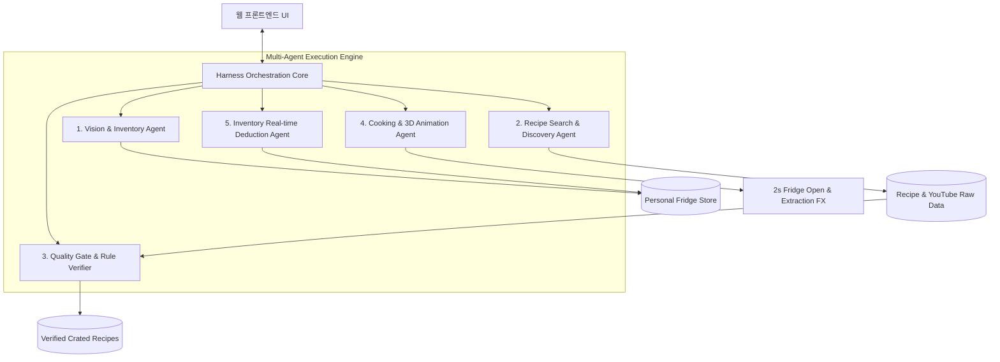

# 키친 셰프 (Kitchen Chef) 멀티 에이전트 하네스 표준 규칙 (agents.md)

본 문서는 하네스(Harness) 아키텍처를 기반으로 동작하는 레시피 추천 및 냉장고 관리 멀티 에이전트 시스템의 동작 표준, 에이전트 간 협업 프로토콜, 그리고 한국 데이터 품질 및 선별 규칙을 정의합니다.

---

## 1. 하네스(Harness) 시스템 아키텍처

하네스는 각 전문 에이전트의 생명주기(Lifecycle), 이벤트 흐름(Pub-Sub), 파이프라인 무결성, 그리고 출력 데이터의 품질 검증(Quality Gate)을 통제하는 중추 프레임워크입니다.



---

## 2. 개별 에이전트 역할 및 인터페이스 명세

### 1) Orchestrator Agent (`agent-core.js` / `backend/agents/orchestrator.py`)
- **역할**: 전체 워크플로우 통제, 상태 머신 전이(State Transition), 에이전트 간 이벤트 버스 중계.
- **입력**: 사용자 액션 (`ADD_INGREDIENT`, `OPEN_FRIDGE_AND_COOK`, `COMPLETE_RECIPE` 등)
- **출력**: 파이프라인 단계별 진행률, 시스템 상태 알림 이벤트.

### 2) Vision & Inventory Agent (`vision-agent.js` / `backend/agents/vision_agent.py`)
- **역할**: 냉장고 내부 사진 또는 장보기 영수증 이미지 분석, 자연어 텍스트 파싱을 통해 식재료 목록을 개인 냉장고에 등록.
- **표준 규칙**:
  - 식재료명 정규화 (예: "대파 한단" -> 품목: "대파", 수량: 1, 단위: "단", 보관: "야채칸")
  - 신선도 및 보관 칸 기본값 자동 매핑:
    * 채소/과일 -> 야채칸 (유통기한 기본 7일)
    * 육류/해산물 -> 신선실/냉동실 (유통기한 기본 3~5일)
    * 유제품/달걀/두부 -> 다목적선반 (유통기한 기본 7~10일)
    * 양념/소스 -> 도어칸 (유통기한 30일 이상)

### 3) Recipe Search & YouTube Curation Agent (`search-agent.js` / `backend/agents/search_agent.py`)
- **역할**: 사용자의 현재 보유 식재료 및 선택 테마, 또는 직접 입력받은 메뉴/조리방식을 바탕으로 최적의 레시피 탐색 및 종합 생성.
- **데이터 종합 수집 및 추천 규칙 (필수 준수)**:
  - **레시피 추천 에이전트는 외부 인터넷 자료(레시피 자료 + 유튜브 영상)을 조회수, 추천수, 인기순으로 검색 하거나 홈페이지 내 사용자들이 직접 만든 공유된 레시피들의 데이터를 종합 수집하여 추천해줘야 한다.**
  - 사용자가 직접 등록한 레시피와 외부 공인 레시피 간에 같은 메뉴가 있더라도, 다양한 사용자 노하우와 조리 방식을 함께 비교할 수 있도록 중복 추천을 허용한다.

### 4) Quality Gate & Rule Verification Agent (`quality-agent.js` / `backend/agents/quality_agent.py`)
- **역할**: 탐색된 레시피가 본 표준 규칙을 만족하는지 엄격히 검증.
- **한국 데이터 기반 표준 필터링 규칙 (필수 준수)**:
  1. **언어 및 문화권**: 반드시 **한국어 데이터** 및 **한국 가정식 기반 레시피**만 채택.
  2. **유튜브 채널 공신력**:
     - 구독자 수: 최소 **5만 명 이상** (권장: 30만 명 이상 공인 채널 - 백종원의 요리비책, 뚝딱이형, 하루한끼 등)
     - 영상 조회수: 최소 **10만 회 이상** (인기 검증 레시피 50만~100만 회 이상 우선)
  3. **재료 일치율(Match Rate)**:
     - 최소 **70% 이상**의 재료 일치율을 가진 레시피만 추천 목록에 포함.
     - 필수 주재료(예: 스팸, 김치 등)가 사용자 냉장고에 존재하는지 우선 가중치 부여.
  4. **계량 단위 표준화**:
     - 밥숟가락(T), 종이컵(cup), 그램(g), 개/알 단위 등 직관적 한국식 계량 표기.

### 5) Animation & Motion Agent (`agent-motion.js`)
- **역할**: 레시피 탐색 및 조리 확정 시 인터랙티브 3D 냉장고 애니메이션 구동.
- **표준 규칙**:
  - **최소 2초 강제 노출**: 사용자가 레시피 생성을 요청했을 때 `0.0s`부터 `2.0s`까지 냉장고 문이 열리고, 재료가 부유하여 도마 위로 떨어지는 모션을 반드시 2초간 재생한 후 결과 화면으로 전환.
  - 사운드 및 파티클 이펙트 상태 제어.

### 6) Inventory Real-time Deduction Agent (`store.js` / `backend/agents/deduction_agent.py`)
- **역할**: 사용자가 레시피를 선택하고 `[레시피 조리하기]` 또는 `[조리 완료 및 재료 소진]`을 확정했을 때, 해당 요리에 사용된 식재료를 사용자의 개인 냉장고에서 실시간으로 정량 차감.
- **표준 규칙**:
  - 잔여량이 0 이하가 될 경우 '완전 소진(장보기 추가)' 상태로 갱신하거나 보관함에서 안전하게 제거/알림.
  - 사용자의 동의 없는 임의 소진 방지(토글 스위치 제공).

---

## 3. 에이전트 통신 프로토콜 (Event Schema)

```json
{
  "eventId": "evt_1726543000000",
  "timestamp": "2026-09-17T02:24:00Z",
  "sourceAgent": "RecipeSearchAgent",
  "targetAgent": "QualityGateAgent",
  "action": "VERIFY_RECIPES",
  "payload": {
    "userId": "user_chef_sora",
    "selectedIngredients": ["대파", "계란", "즉석밥", "진간장"],
    "theme": "quick_15min",
    "candidateCount": 8
  }
}
```

---

## 4. 하네스 테스트 & 검증 기준

- 모든 레시피 추천 결과는 `QualityGateAgent`의 검증 로그를 통과해야 합니다 (`STATUS: PASSED`).
- 냉장고 재료 변경 및 차감 이벤트는 원자적(Atomic)으로 처리되어야 하며, LocalStorage 동기화 실패 시 롤백되어야 합니다.
- 2초 애니메이션 타이머는 브라우저 비활성 탭 상태에서도 정확히 계산되어야 합니다.
